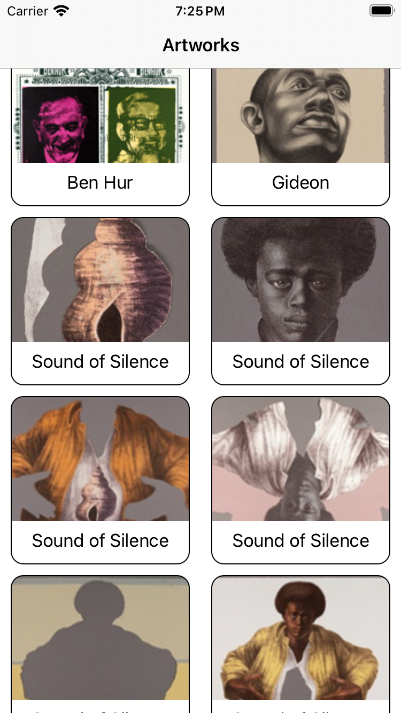
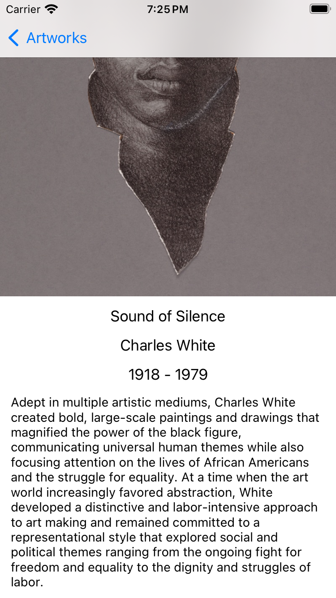

<!-- Improved compatibility of back to top link: See: https://github.com/othneildrew/Best-README-Template/pull/73 -->
<a name="readme-top"></a>
<!--
*** Thanks for checking out the Best-README-Template. If you have a suggestion
*** that would make this better, please fork the repo and create a pull request
*** or simply open an issue with the tag "enhancement".
*** Don't forget to give the project a star!
*** Thanks again! Now go create something AMAZING! :D
-->


<!-- PROJECT SHIELDS -->
<!--
*** I'm using markdown "reference style" links for readability.
*** Reference links are enclosed in brackets [ ] instead of parentheses ( ).
*** See the bottom of this document for the declaration of the reference variables
*** for contributors-url, forks-url, etc. This is an optional, concise syntax you may use.
*** https://www.markdownguide.org/basic-syntax/#reference-style-links
-->
[![Contributors][contributors-shield]][contributors-url]
[![Forks][forks-shield]][forks-url]
[![Stargazers][stars-shield]][stars-url]
[![Issues][issues-shield]][issues-url]
[![MIT License][license-shield]][license-url]
[![LinkedIn][linkedin-shield]][linkedin-url]


<!-- PROJECT LOGO -->
<br />
<div align="center">
  <a href="https://github.com/ArtemPrivet/ArtGallery">
    
  </a>

<h3 align="center">Art Gallery</h3>

  <p align="center">
    The way to exlore arts
    <br />
    <a href="https://github.com/ArtemPrivet/ArtGallery"><strong>Explore the docs »</strong></a>
    <br />
    <br />
    <a href="https://github.com/ArtemPrivet/ArtGallery/issues">Report Bug</a>
    ·
    <a href="https://github.com/ArtemPrivet/ArtGallery/issues">Request Feature</a>
  </p>
</div>


<!-- TABLE OF CONTENTS -->
<details>
  <summary>Table of Contents</summary>
  <ol>
    <li>
      <a href="#about-the-project">About The Project</a>
    </li>
    <li>
      <a href="#getting-started">Getting Started</a>
      <ul>
        <li><a href="#installation">Installation</a></li>
      </ul>
    </li>
    <li><a href="#roadmap">Roadmap</a></li>
    <li><a href="#contributing">Contributing</a></li>
    <li><a href="#acknowledgments">Acknowledgments</a></li>
  </ol>
</details>


<!-- ABOUT THE PROJECT -->
## About The Project

<details>
  <summary>Screenshots</summary>
  <div>
  
  
</div>
</details>


App is using an open API of Art Institute of Chicago. 
* Supports iOS 13.0+
* Arcitecture: MVP+Router
* UI: UIKit
* Third-party libraries: [Kingfisher](https://github.com/onevcat/Kingfisher)
* Dependency Manager: SPM


<details>
  <summary>More Info:</summary>
UIKit was chosen in this app since the minimum supported iOS version is 13. At this version, SwiftUI is relatively new and lacks stability. 

Regarding the architecture, given the project's size, complex architectures aren't necessary. Therefore, I've implemented a Presenter to shift a significant portion of the logic away from the ViewController. This approach not only segregates responsibilities but also facilitates the testing of logic.

Additionally, I introduced a Router to extract navigation logic from the View. An alternative would have been using a Coordinator, but that seemed excessive for this project's scope.

The project is segmented into three modules: ArtGallery, Domain, and Networking.

<b>ArtGallery</b>: Contains all the screens and logic for them.

<b>Domain</b>: Contains all the models used in the project, along with relevant protocols.

<b>Networking</b>: Centralizes all the logic required to request data from the internet.


The only third-party library used is Kingfisher, which simplifies working with images.


</details>

<p align="right">(<a href="#readme-top">back to top</a>)</p>

<!-- GETTING STARTED -->
## Getting Started

You don't need any API keys to use this project. By default you have 60 request per minute.
[More info](https://api.artic.edu/docs/#authentication)

### Installation

1. Clone the repo
   ```sh
   git clone https://github.com/ArtemPrivet/ArtGallery.git
   ```
### Tests
Currently there are only tests in the main project, so to run them you need to press CMD+U within ArtGallery target

<p align="right">(<a href="#readme-top">back to top</a>)</p>

<!-- ROADMAP -->
## Roadmap

- [ ] Use the fields parameter to tell exactly what fields to request.
- [ ] Add better loading animations
- [ ] Snapshot Tests
- [ ] Improve UI

See the [open issues](https://github.com/ArtemPrivet/ArtGallery/issues) for a full list of proposed features (and known issues).

<p align="right">(<a href="#readme-top">back to top</a>)</p>


<!-- CONTRIBUTING -->
## Contributing

Contributions are what make the open source community such an amazing place to learn, inspire, and create. Any contributions you make are **greatly appreciated**.

If you have a suggestion that would make this better, please fork the repo and create a pull request. You can also simply open an issue with the tag "enhancement".
Don't forget to give the project a star! Thanks again!

1. Fork the Project
2. Create your Feature Branch (`git checkout -b feature/AmazingFeature`)
3. Commit your Changes (`git commit -m 'Add some AmazingFeature'`)
4. Push to the Branch (`git push origin feature/AmazingFeature`)
5. Open a Pull Request

<p align="right">(<a href="#readme-top">back to top</a>)</p>

<!-- ACKNOWLEDGMENTS -->
## Acknowledgments

* [API Documentation](https://api.artic.edu/docs/#introduction)
* [KIngfisher](https://github.com/onevcat/Kingfisher)

<p align="right">(<a href="#readme-top">back to top</a>)</p>


<!-- MARKDOWN LINKS & IMAGES -->
<!-- https://www.markdownguide.org/basic-syntax/#reference-style-links -->
[contributors-shield]: https://img.shields.io/github/contributors/ArtemPrivet/ArtGallery.svg?style=for-the-badge
[contributors-url]: https://github.com/ArtemPrivet/ArtGallery/graphs/contributors
[forks-shield]: https://img.shields.io/github/forks/ArtemPrivet/ArtGallery.svg?style=for-the-badge
[forks-url]: https://github.com/ArtemPrivet/ArtGallery/network/members
[stars-shield]: https://img.shields.io/github/stars/ArtemPrivet/ArtGallery.svg?style=for-the-badge
[stars-url]: https://github.com/ArtemPrivet/ArtGallery/stargazers
[issues-shield]: https://img.shields.io/github/issues/ArtemPrivet/ArtGallery.svg?style=for-the-badge
[issues-url]: https://github.com/ArtemPrivet/ArtGallery/issues
[license-shield]: https://img.shields.io/github/license/ArtemPrivet/ArtGallery.svg?style=for-the-badge
[license-url]: https://github.com/ArtemPrivet/ArtGallery/blob/master/LICENSE.txt
[linkedin-shield]: https://img.shields.io/badge/-LinkedIn-black.svg?style=for-the-badge&logo=linkedin&colorB=555
[linkedin-url]: https://linkedin.com/in/artem-orlov-ios/
[product-screenshot]: images/main_screen.png
